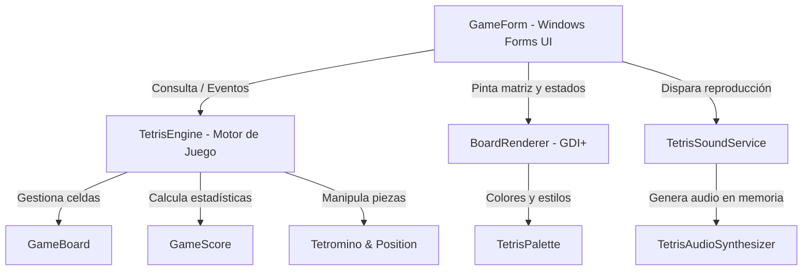

# 🕹️ Tetris Clásico en Windows Forms (.NET 10)

[](https://dotnet.microsoft.com/)
[](https://learn.microsoft.com/dotnet/csharp/)
[](https://learn.microsoft.com/dotnet/desktop/winforms/)
[](https://xunit.net/)
[](LICENSE)

Implementación moderna, desacoplada y fiel del legendario **Tetris** en **C# y .NET 10**, utilizando **Windows Forms** y renderizado acelerado por **GDI+**. El proyecto incorpora retos avanzados de desarrollo de videojuegos clásicos: **proyección de pieza fantasma (*Ghost Piece*)**, **síntesis procedural de música retro (*Korobeiniki* / Tema A)**, **efectos de sonido multicanal independientes** y una **suite completa de 130 pruebas unitarias automatizadas**.

---

## 📑 Tabla de Contenidos

1. [✨ Características Principales](#-características-principales)
2. [🎮 Controles del Juego](#-controles-del-juego)
3. [🧩 Retos de Ingeniería Implementados](#-retos-de-ingeniería-implementados)
   - [Proyección de Pieza Fantasma (Ghost Piece)](#1-proyección-de-pieza-fantasma-ghost-piece)
   - [Síntesis de Audio y BSO Retro (Korobeiniki)](#2-síntesis-de-audio-y-bso-retro-korobeiniki)
   - [Arquitectura Multicanal de Audio (MCI + SoundPlayer)](#3-arquitectura-multicanal-de-audio-mci--soundplayer)
4. [📐 Arquitectura del Software](#-arquitectura-del-software)
5. [🧪 Pruebas Unitarias (130 Tests)](#-pruebas-unitarias-130-tests)
6. [🚀 Requisitos e Instalación](#-requisitos-e-instalación)
7. [📂 Estructura del Repositorio](#-estructura-del-repositorio)
8. [📄 Licencia](#-licencia)

---

## ✨ Características Principales

- **Física y Reglas Oficiales de Tetris**:
  - Matriz clásica de **10 columnas × 20 filas**.
  - Los 7 tetrominós canónicos (**I, J, L, O, S, T, Z**) con geometrías y rotaciones estándar.
  - Sistema de rotación con **Wall Kicks** básicos (desplazamiento correctivo si choca con los bordes laterales).
  - Caída instantánea dura (**Hard Drop**) con bonificación de puntos por distancia recorrida.
  - Vista previa de la **Siguiente Pieza** (*Next Piece Preview*).
- **Progresión Dinámica de Niveles y Puntuación**:
  - Sistema de puntuación tradicional:
    - **1 Línea**: 100 × Nivel
    - **2 Líneas**: 300 × Nivel
    - **3 Líneas**: 500 × Nivel
    - **4 Líneas (¡Tetris!)**: 800 × Nivel
    - **Hard Drop**: 2 puntos por celda de caída libre.
  - Incremento de nivel por cada **10 líneas eliminadas**.
  - Aceleración dinámica de la gravedad por nivel (reducción progresiva de milisegundos por caída).
- **Interfaz Visual Moderna (GDI+)**:
  - Paleta oscura contemporánea inspirada en temas modernos (*Slate / Cyberpunk*).
  - Renderizado de bloques con iluminación biselada 3D (*bevel effects*).
  - Pantallas de bienvenida, pausa contextual y Game Over dibujadas dinámicamente.
  - Soporte de renderizado suave sin parpadeo (**Double Buffering** activo).
- **Audio Retro en Tiempo Real (Sin dependencias externas ni archivos pesados)**:
  - Generación procedural en memoria de ondas sonoras en formato **WAV PCM 16-bit Mono a 22.05 kHz**.
  - BGM en bucle continuo de la melodía rusa **Korobeiniki** (Tetris Theme A) con canal melódico (onda cuadrada) y bajo acompañante (onda triangular).
  - Efectos sonoros independientes para rotación, despeje de líneas, Tetris cuádruple y Game Over.

---

## 🎮 Controles del Juego

El juego puede ser controlado indistintamente mediante el **teclado** o mediante los **botones de la interfaz lateral**:

| Acción | Tecla Principal | Alternativa | Botón en Pantalla |
| :--- | :---: | :---: | :---: |
| **Mover a la Izquierda** | `←` (Flecha Izquierda) | `A` | — |
| **Mover a la Derecha** | `→` (Flecha Derecha) | `D` | — |
| **Bajar Rápido (Soft Drop)** | `↓` (Flecha Abajo) | `S` | — |
| **Rotar Pieza (Horario)** | `↑` (Flecha Arriba) | `W` | — |
| **Caída Instantánea (Hard Drop)** | `Espacio` | — | — |
| **Pausar / Reanudar** | `P` | — | `btnPausa` |
| **Silenciar / Activar Sonido** | `M` | — | `btnSonido` |
| **Iniciar / Reiniciar Partida** | — | — | `btnIniciar` |

---

## 🧩 Retos de Ingeniería Implementados

### 1. Proyección de Pieza Fantasma (Ghost Piece)
La pieza fantasma calcula en tiempo real dónde aterrizará el tetrominó activo en caso de producirse un *Hard Drop*:
- El motor (`TetrisEngine.GetGhostPosition()`) proyecta un clon de la posición actual iterando hacia abajo con `Board.CanPlace()` hasta encontrar la primera colisión física.
- El renderizador (`BoardRenderer.DrawGhostBlock()`) dibuja una silueta translúcida con transparencia alfa ($A = 60$) y borde acentuado ($A = 140$), evitando superponerse a la pieza activa cuando ambas coinciden.

### 2. Síntesis de Audio y BSO Retro (Korobeiniki)
Para no depender de archivos MP3 o WAV externos en disco que pudieran perderse o corromperse, se diseñó un **sintetizador de audio procedural en C# puro** (`TetrisAudioSynthesizer`):
- Construye las cabeceras estándar **RIFF/WAVE** en un `MemoryStream`.
- Síntesis de onda cuadrada (*Square Wave*) con ciclo de trabajo del 50% para simular el chip de audio NES/Game Boy.
- Síntesis de onda triangular (*Triangle Wave*) para la línea de bajo.
- Envolvente ADSR suavizada para evitar clics y chasquidos (*pops/clicks*) en las transiciones de notas.
- Incluye la partitura completa y precisa de **Korobeiniki** (compases 1 al 16) a tempo retro de 144 BPM.

### 3. Arquitectura Multicanal de Audio (MCI + SoundPlayer)
En Windows Forms, la clase estándar `System.Media.SoundPlayer` utiliza la API subyacente `PlaySound`, la cual dispone de **un único canal de audio global por proceso**. En implementaciones ingenuas, reproducir un efecto de rotación detiene o reinicia la música desde el segundo 0.

Para resolver este desafío de concurrencia:
- **Música de Fondo (BGM)**: Se reproduce en bucle continuo utilizando `SoundPlayer.PlayLooping()` sobre el flujo sintetizado en memoria.
- **Efectos de Sonido (SFX)**: Se gestionan a través de alias independientes de la **API multimedia de Windows (`winmm.dll` - `mciSendString`)**, abriendo canales concurrentes en segundo plano.
- Esto garantiza que **la música de fondo nunca se interrumpa ni reinicie** al girar piezas o despejar líneas.
- Dispone de mecanismo de *fallback* automático en entornos donde MCI no esté disponible.

---

## 📐 Arquitectura del Software

El código fuente sigue los principios de **Arquitectura Limpia (Clean Architecture)** y **Separación de Responsabilidades (SoC)**, estructurado en cuatro módulos desacoplados:



### Componentes Clave:
- **`TetrisApp.Engine`**:
  - `TetrisEngine`: Motor central independiente de la UI. Gestiona el bucle de juego, la gravedad, traslaciones, colisiones, eventos (`BoardChanged`, `ScoreChanged`, `StateChanged`, `PieceRotated`, `LinesCleared`, `GameOver`) y cálculo de la pieza fantasma.
- **`TetrisApp.Models`**:
  - `GameBoard`: Matriz bidimensional de $20 \times 10$ con validación de límites, anclaje de bloques y eliminación de líneas completas.
  - `Tetromino`: Representación inmutable de piezas con sus matrices de rotación precalculadas.
  - `GameScore`: Algoritmo de puntuación clásica, niveles y curva de velocidad de caída.
  - `GameState`: Enumerador de estados (`NotStarted`, `Playing`, `Paused`, `GameOver`).
- **`TetrisApp.Rendering`**:
  - `BoardRenderer`: Encapsula todas las operaciones GDI+, centrado del tablero en pantalla, sombras, texto superpuesto en pausa/game over y celda fantasma.
  - `TetrisPalette`: Definición centralizada de colores RGB oficiales.
- **`TetrisApp.Audio`**:
  - `TetrisAudioSynthesizer`: Generador procedural PCM/WAV.
  - `TetrisSoundService`: Controlador de reproducción multicanal y muteo global.

---

## 🧪 Pruebas Unitarias (130 Tests)

El proyecto cuenta con una cobertura integral implementada en **xUnit** dentro del proyecto `TetrisApp.Tests`, asegurando la estabilidad y robustez de cada componente:

```text
Passed!  - Failed: 0, Passed: 130, Skipped: 0, Total: 130, Duration: 1 s
```

### Distribución de las Pruebas:
- **`PositionTests` (8 pruebas)**: Operaciones matemáticas de traslación espacial (`Down`, `Left`, `Right`).
- **`TetrominoTests` (15 pruebas)**: Creación de cada uno de los 7 tetrominós, matrices de rotación horaria de 360°, y consistencia dimensional.
- **`GameBoardTests` (27 pruebas)**: Detección de colisiones contra bordes, colisión con piezas fijadas, anclaje en el tablero y algoritmo de limpieza de líneas únicas y simultáneas.
- **`GameScoreTests` (15 pruebas)**: Progresión de niveles, cálculo de puntuación para 1, 2, 3 y 4 líneas (*Tetris bonus*), bonificación de *Hard Drop* y fórmula de aceleración temporal.
- **`TetrisPaletteTests` (10 pruebas)**: Mapeo correcto de colores para cada tetrominó y contrastes del tablero.
- **`BoardRendererTests` (12 pruebas)**: Creación de instancias, escalado de celdas, renderizado del tablero con y sin pieza activa, y proyección de pieza fantasma.
- **`TetrisEngineTests` (23 pruebas)**: Ciclo completo del motor, arranque de partida, pausa/reanudación, traslaciones permitidas/bloqueadas, rotaciones con y sin *Wall Kick*, proyección fantasma y detección de Game Over.
- **`TetrisAudioSynthesizerTests` (12 pruebas)**: Verificación de firmas binarias WAV (`RIFF`, `WAVE`, `fmt `, `data`), frecuencia de muestreo de 22050 Hz, 16 bits y validación de streams generados.
- **`TetrisSoundServiceTests` (6 pruebas)**: Inicialización del servicio de sonido, conmutación de estado silenciado (*Mute*), llamadas a BGM y efectos sonoros.
- **`GameFormTests` (2 pruebas)**: Inicialización del formulario, vinculación de controles y presencia de `btnSonido` en subproceso STA (*Single-Threaded Apartment*).

Para ejecutar todas las pruebas unitarias:
```bash
dotnet test
```

---

## 🚀 Requisitos e Instalación

### Prerrequisitos
- **Sistema Operativo**: Windows 10 / Windows 11 (requerido por Windows Forms).
- **SDK**: [.NET 10.0 SDK](https://dotnet.microsoft.com/download/dotnet/10.0) o superior.
- **IDE Recomendado**: Visual Studio 2026 / 2022 (con carga de trabajo de *.NET Desktop Development*) o Visual Studio Code con extensiones de C#.

### Clonar y Compilar

1. **Clonar el repositorio:**
   ```bash
   git clone https://github.com/ArielCusipumaOrtega/TetrisClasico-WinForms.git
   cd TetrisClasico-WinForms
   ```

2. **Restaurar paquetes y dependencias:**
   ```bash
   dotnet restore
   ```

3. **Compilar la solución:**
   ```bash
   dotnet build --configuration Release
   ```

4. **Ejecutar el juego:**
   ```bash
   dotnet run --project TetrisApp
   ```

---

## 📂 Estructura del Repositorio

```text
TetrisApp/
│
├── .gitignore
├── TetrisApp.slnx                     # Solución moderna de Visual Studio (.slnx)
│
├── TetrisApp/                         # Proyecto principal de la aplicación WinForms
│   ├── Audio/
│   │   ├── TetrisAudioSynthesizer.cs  # Sintetizador procedural PCM/WAV (Korobeiniki + SFX)
│   │   └── TetrisSoundService.cs      # Servicio multicanal (SoundPlayer + Win32 MCI)
│   ├── Engine/
│   │   └── TetrisEngine.cs            # Motor desacoplado de lógica, física y eventos
│   ├── Models/
│   │   ├── GameBoard.cs               # Matriz de 10x20 y despeje de filas
│   │   ├── GameScore.cs               # Puntajes, niveles y velocidad
│   │   ├── GameState.cs               # Estados de la máquina de estados finitos
│   │   ├── Position.cs                # Coordenadas inmutables (Row, Column)
│   │   ├── Tetromino.cs               # Geometría y rotación de tetrominós
│   │   └── TetrominoType.cs           # Tipos de pieza (I, J, L, O, S, T, Z)
│   ├── Rendering/
│   │   ├── BoardRenderer.cs           # Pintado GDI+, sombras, relieve y Ghost Piece
│   │   └── TetrisPalette.cs           # Paleta oficial de colores
│   ├── GameForm.cs                    # Lógica de presentación y eventos de teclado
│   ├── GameForm.Designer.cs           # Controles visuales generados por el Diseñador
│   ├── GameForm.resx                  # Recursos de la ventana
│   ├── Program.cs                     # Punto de entrada de la aplicación WinForms
│   └── TetrisApp.csproj
│
└── TetrisApp.Tests/                   # Suite de pruebas unitarias xUnit
    ├── Audio/                         # Pruebas del sintetizador y servicio de audio
    ├── Engine/                        # Pruebas del motor y física
    ├── Models/                        # Pruebas de colisiones, rotación y puntaje
    ├── Rendering/                     # Pruebas del renderizador GDI+
    ├── UI/                            # Pruebas de integración visual de WinForms
    └── TetrisApp.Tests.csproj
```

---

## 📄 Licencia

Este proyecto está bajo la Licencia **MIT**. Consulta el archivo [LICENSE](LICENSE) para más detalles.

Desarrollado con pasión y buenas prácticas de ingeniería de software por **Ariel Cusipuma Ortega**.
